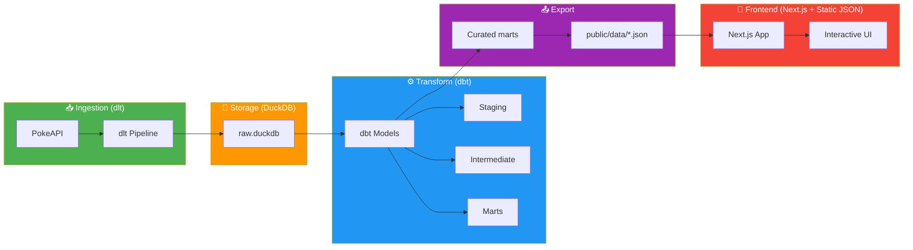

<!-- markdownlint-disable -->

<div align="center">
  

# Pokédex Pipeline

**A modern data pipeline combining dlt + DuckDB + dbt + Next.js + materialized JSON files for Pokémon data visualization**

[📖 Documentation](#quickstart) · [🐛 Report Issue](https://github.com/thangbuiq/pokemon-dlt-dbt-pipeline/issues)

</div>

---

## Motivation why I built this

My work basically goes around building data-related things. But the data that we work with at work is... well, it's not exactly the most exciting data in the world. It's business data, which was SUPER MEGA boring, so it was hard to get excited about building cool dashboards or writing the transformations that I actually not care about. I wanted to build something tha smile every time I opened it.

So one Sunday I asked myself - what if I just built something I actually wanted to look at? And then I look at the Nintendo Switch on my desk. I've just remembered that I have a childhood obsession with Pokémon, and I used to spend 8 hours/day playing Pokémon games when I was a kid, so I thought - why not build a Pokémon dashboard? Because I grew up with Pokémon, and I work with data pipelines when I grow up, somewhere between those two facts (very randomly), this project was born.

It's not that deep. I wanted to play with tools I liked, on data I actually cared about, with a UI that looked cool. No stakeholders. No Jira tickets. No one asking me to change the color of a bar chart.
Just me, a free API, and the completely unnecessary but deeply satisfying goal of making my inside 10-year-old self proud.

Sometimes the best reason to build something is that you genuinely want it to exist.

> tl;dr - I built this for fun, to learn, and to have a cool dashboard that I actually wanted to use. No other reason than that.

## Architecture



## monorepo Structure

```
pokemon-dlt-dbt-pipeline/
├── pokemon-dlt-pipeline/     # Data ingestion with dlt
│   └── pokemon_pipeline/
│       ├── pipeline.py       # Main entry point
│       ├── sources/         # @dlt.source + @dlt.resource
│       └── export.py       # Export curated tables
├── pokemon-dbt-pipeline/  # Transformations with dbt
│   ├── models/
│   │   ├── staging/        # stg_* (join child tables)
│   │   ├── intermediate/  # int_* (enriched, flattened)
│   │   └── marts/         # dim_* + fct_* (analytics)
│   └── seeds/             # type_effectiveness.csv
├── pokemon-dashboard-app/ # Next.js 16 + static JSON data
│   ├── src/
│   │   ├── app/            # 9 routes
│   │   ├── components/     # UI components
│   │   └── lib/            # JSON hooks, design tokens
│   └── public/
│       └── data/           # Materialized JSON files for frontend
└── data/                   # DuckDB storage
```

## Features

- **Materialized JSON Data**: Frontend reads precomputed JSON snapshots from `public/data`
- **Type Effectiveness Matrix**: Calculate battle advantages
- **Evolution Trees**: Visualize Pokemon evolution chains
- **Team Builder**: Build and analyze your dream team
- **Retro Game Boy UI**: Nostalgic pixel-perfect design

## Tech Stack

| Layer         | Technology                                         |
| ------------- | -------------------------------------------------- |
| Ingestion     | [dlt](https://dlthub.com), Python                  |
| Storage       | [DuckDB](https://duckdb.org)                       |
| Transform     | [dbt-duckdb](https://github.com/duckdb/dbt-duckdb) |
| Frontend      | [Next.js 16](https://nextjs.org), React            |
| Data Delivery | Static JSON files materialized from DuckDB marts   |
| Styling       | Tailwind CSS                                       |
| Testing       | Vitest, Playwright                                 |
| Task Runner   | [Just](https://just.systems)                       |

## Quickstart

### Prerequisites

- [Python 3.11+](https://python.org)
- [uv](https://github.com/astral-sh/uv) (Python package manager)
- [bun](https://bun.sh) (JavaScript runtime)
- [just](https://just.systems) (Task runner)
- [Node.js 18+](https://nodejs.org) (for Vercel CLI)

### Installation

```bash
# Clone the repository
git clone https://github.com/thangbuiq/pokemon-dlt-dbt-pipeline
cd pokemon-dlt-dbt-pipeline

# Install all dependencies (Python + JavaScript)
just install
```

### Run the Pipeline

```bash
# Full pipeline: extract → transform → materialize frontend JSON
just data

# Or run individual steps
just pipeline    # Extract data from PokeAPI
just transform   # Run dbt transformations
just export      # Materialize curated JSON files into pokemon-dashboard-app/public/data
```

### Development

```bash
# Start the dashboard
just dashboard   # Opens http://localhost:3000

# Run tests
just test

# Build for production
just build
just deploy      # Deploy to Vercel
```

## Contributing

Contributions are welcome! Whether it's a bug fix, new feature, or documentation improvement—help make this project better.

### Development Workflow

1. Fork the repository
2. Create a feature branch (`git checkout -b feature/amazing-feature`)
3. Make your changes
4. Run tests (`just test`)
5. Commit your changes (`git commit -m 'feat: add amazing feature'`)
6. Push to the branch (`git push origin feature/amazing-feature`)
7. Open a Pull Request

### Testing

```bash
# Python tests (dlt pipeline)
cd pokemon-dlt-pipeline && uv run pytest

# dbt tests
cd pokemon-dbt-pipeline && uv run dbt test

# Frontend tests
cd pokemon-dashboard-app && bun test

# E2E tests
cd pokemon-dashboard-app && bunx playwright test
```

## License

MIT License - see [LICENSE](LICENSE) for details.
