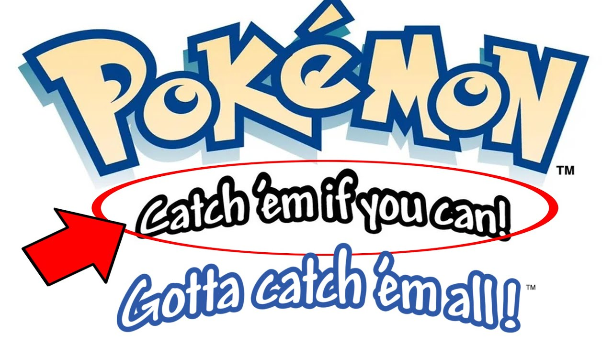
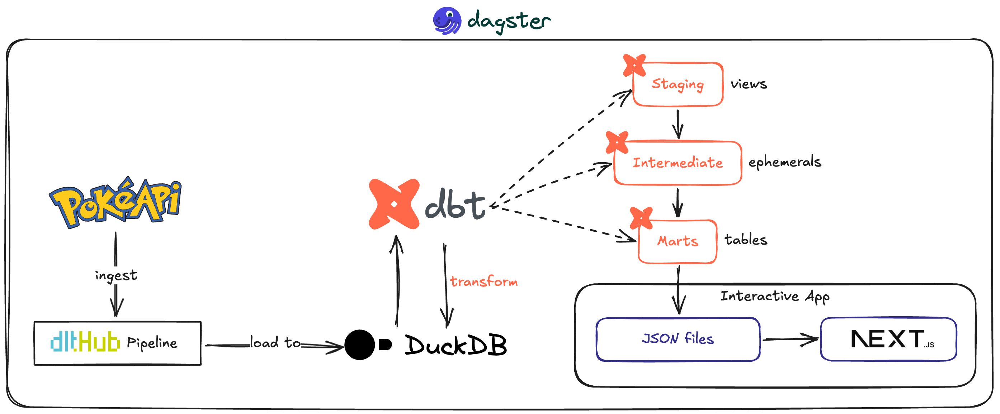
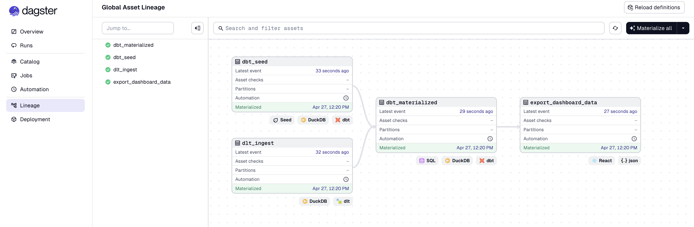

<!-- markdownlint-disable -->

<div align="center">
  

# NextGen Pokédex - pokedexgen

**A modern approach to the Pokédex, gotta catch 'em all with data-driven insights!**

[](#)
[](LICENSE)


</div>

---

## Why This Slaps ⚡

Yeah, yeah, there are a ton of Pokédex apps. But how many actually go hard with a modern data stack and clean, reliable data source? Exactly.

This isn’t just a Pokédex, it’s your all-in-one battle HQ: deep stats, slick team builder, and a type matchup matrix that actually helps you win more Pokemon games. No more endless scrolling or tab-hopping.

<div align="center">
  
</div>

## Motivation why I built this

My work basically goes around building data-related things. But the data that we work with at work is... well, it's not exactly the most exciting data in the world. It's business data, which was SUPER MEGA boring, so it was hard to get excited about building cool dashboards or writing the transformations that I actually not care about. I wanted to build something tha smile every time I opened it.

So one Sunday I asked myself - what if I just built something I actually wanted to look at? And then I look at the Nintendo Switch on my desk. I've just remembered that I have a childhood obsession with Pokémon, and I used to spend 8 hours/day playing Pokémon games when I was a kid, so I thought - why not build a Pokémon dashboard? Because I grew up with Pokémon, and I work with data pipelines when I grow up, somewhere between those two facts (very randomly), this project was born.

It's not that deep. I wanted to play with tools I liked, on data I actually cared about, with a UI that looked cool. No stakeholders. No Jira tickets. No one asking me to change the color of a bar chart.
Just me, a free API, and the completely unnecessary but deeply satisfying goal of making my inside 10-year-old self proud.

Sometimes the best reason to build something is that you genuinely want it to exist.

> tl;dr - I built this for fun, to learn, and to have a cool dashboard that I actually wanted to use. No other reason than that.

## project flow

okay, enough of the backstory. Let's talk about how this thing actually works.



and the dagster orchestration looks like this:



## monorepo Structure

```
pokemon-dlt-dbt-pipeline/
├── pokemon-dlt-pipeline/     # Data ingestion with dlt
│   └── pokemon_pipeline/
│       ├── pipeline.py       # Main entry point
│       ├── sources/          # @dlt.source + @dlt.resource
│       └── export.py         # Export curated tables
├── pokemon-dbt-pipeline/     # Transformations with dbt
│   ├── models/
│   │   ├── staging/          # stg_* (join child tables)
│   │   ├── intermediate/     # int_* (enriched, flattened)
│   │   └── marts/            # dim_* + fct_* (analytics)
│   └── seeds/                # type_effectiveness.csv
├── pokemon-dashboard-app/    # Next.js 16 + static JSON data
│   ├── src/
│   │   ├── app/              # Next.js pages and layouts
│   │   ├── components/       # UI components
│   │   └── lib/              # JSON hooks, design tokens
│   └── public/
│       └── data/             # Materialized JSON files for frontend
└── data/                     # DuckDB storage
```

## Features

- **Materialized JSON Data**: Frontend reads precomputed JSON snapshots from `public/data`
- **Type Effectiveness Matrix**: Calculate battle advantages
- **Evolution Trees**: Visualize Pokemon evolution chains
- **Team Builder**: Build and analyze your dream team
- **Retro Game Boy UI**: Nostalgic pixel-perfect design

## Tech Stack

| Layer         | Technology                                         |
| ------------- | -------------------------------------------------- |
| Ingestion     | [dlt](https://dlthub.com), Python                  |
| Storage       | [DuckDB](https://duckdb.org)                       |
| Transform     | [dbt-duckdb](https://github.com/duckdb/dbt-duckdb) |
| Frontend      | [Next.js 16](https://nextjs.org), React            |
| Data Delivery | Static JSON files materialized from DuckDB marts   |
| Styling       | Tailwind CSS                                       |
| Task Runner   | [Just](https://just.systems)                       |

## Quickstart

### Prerequisites

- [Python 3.11+](https://python.org)
- [uv](https://github.com/astral-sh/uv) (Python package manager)
- [bun](https://bun.sh) (JavaScript runtime)
- [just](https://just.systems) (Task runner)
- [Node.js 18+](https://nodejs.org) (for Vercel CLI)

### Installation

```bash
git clone https://github.com/thangbuiq/pokemon-dlt-dbt-pipeline
cd pokemon-dlt-dbt-pipeline
just install
```

### Run the Pipeline

```bash
just data # Run the entire data pipeline (ingest, transform, export)

# Or run individual steps
just pipeline    # Extract data from PokeAPI
just transform   # Run dbt transformations
just export      # Materialize mart layer to JSON files
```

### Dagster Orchestration

```bash
# Start Dagster UI
just dagster

# One-shot materialization (pipeline -> transform -> export)
just dagster-materialize
```

Dagster project is in `pokemon-dagster-app/` and includes a daily schedule for
`pokemon_data_job`.

Incremental dlt note (short): `pokemon_list` now paginates by `offset` and
stores the latest cursor in `data/pokemon_offset_checkpoint.json`, so the next
run resumes from the saved offset instead of re-reading from the first page.

### Development

```bash
# Start the dashboard
just dashboard   # Opens http://localhost:3000

# build the dashboard for production
just build
```

## Contributing

Contributions are welcome! Whether it's a bug fix, new feature, or documentation improvement-help make this project better.

## License

MIT License - see [LICENSE](LICENSE) for details.
